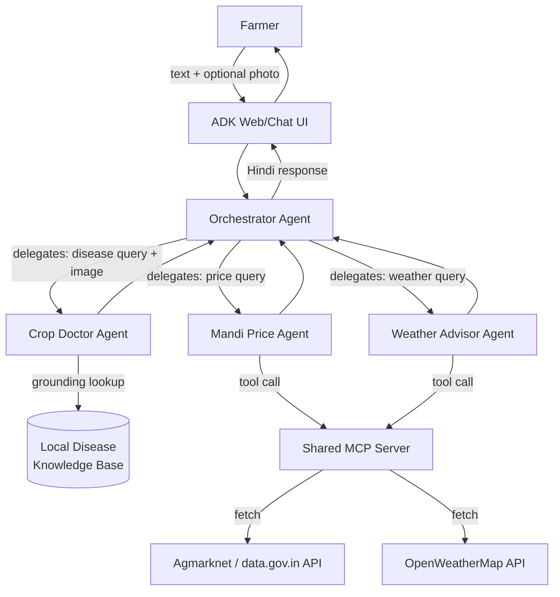
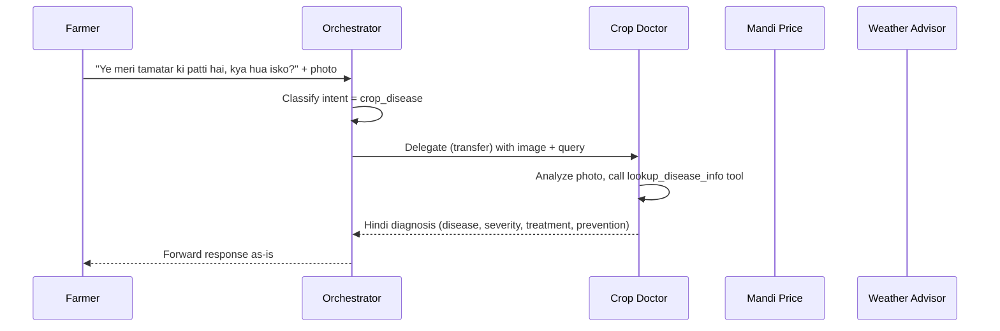
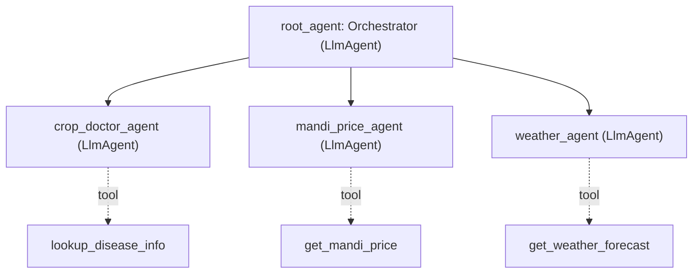
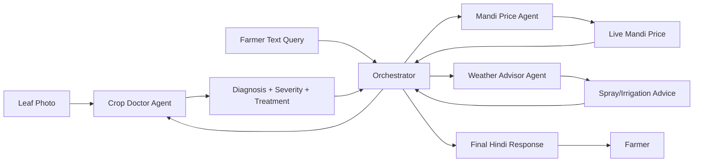
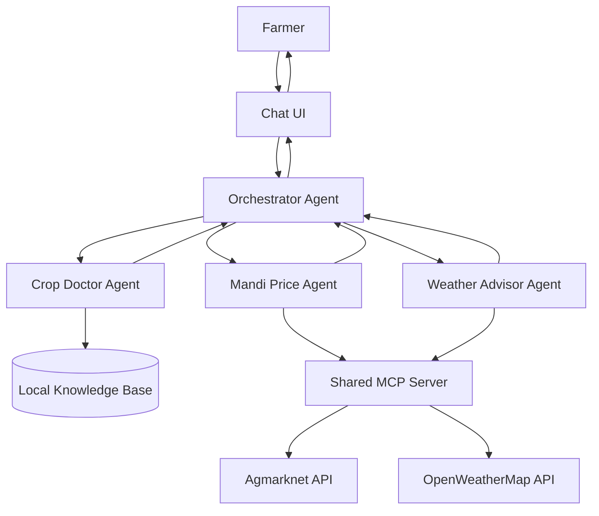

# ARCHITECTURE.md — Kisan Sahayak (Farmer's AI Assistant)

*Revision 2 — incorporates senior-engineering-review improvements. Same
shape as Revision 1: exactly one Orchestrator, exactly three Specialists,
one shared MCP server. No memory, vector DB, planners, critics, queues,
auth, or other production infra added.*

This architecture is deliberately kept **simple for a 5-day solo hackathon
build**. It favors one clear routing pattern (LLM-driven delegation),
one shared MCP server (instead of many), and no persistent database — in
line with the constraints in `SPEC.md`.

---

## 1. High-Level Architecture

Three specialist agents sit behind a single Orchestrator. Two of the three
specialists need external, real-time data, which is served through **one**
shared MCP server to keep the moving parts minimal.



---

**Routing rules (added in review):**
- If the incoming message includes an image, route to Crop Doctor
  regardless of accompanying text — image presence is the strongest
  available intent signal.
- The Orchestrator's instruction includes 3-4 example utterances per
  intent (few-shot), not just an abstract "classify intent" instruction.
- The Orchestrator never answers domain questions itself and never calls
  a tool directly — its only job is classify → transfer.

## 2. Agent Communication Flow

The Orchestrator does not process the farmer's actual question itself — it
only classifies intent and hands off. Each specialist replies directly with
farmer-facing Hindi text, which the Orchestrator passes through unchanged.

**Multi-intent queries:** if a farmer asks about two things in one message
(e.g. disease *and* price), the Orchestrator does **not** fan out to two
specialists in parallel — that adds merge-logic complexity for little
demo value. Instead it picks one primary intent (image present → disease;
otherwise the first-mentioned topic), answers that fully, and appends one
line inviting a separate follow-up message for the second topic.

**Clarification cap:** every agent (Orchestrator included) may ask **at
most one** clarifying question per turn, then must proceed with a
best-effort answer — paired with a confidence disclaimer if uncertain
(see §7). This guarantees the conversation keeps moving during a live
demo.



If the farmer asks a follow-up like "aaj mandi bhaav kya hai?", the
Orchestrator re-classifies and delegates to the Mandi Price Agent instead —
each turn is routed independently.

---

## 3. ADK Agent Hierarchy

Using ADK's standard pattern: one root `LlmAgent` (Orchestrator) with
specialist agents as `sub_agents`, relying on LLM-driven dynamic routing
(agent transfer) rather than a fixed graph — appropriate here because
intent (disease vs. price vs. weather) is naturally decided by
understanding the farmer's free-text question.



- **Orchestrator**: no domain tools of its own; instruction focuses purely
  on classifying intent and transferring control.
- **Specialists**: each owns exactly one job and one set of tools —
  keeps prompts short and behavior predictable, which matters more than
  cleverness in a demo setting.

---

## 4. Tool Architecture

| Agent | Tool | Type | Purpose |
|---|---|---|---|
| Crop Doctor | `lookup_disease_info` | Local Python function (FunctionTool) | Grounds diagnosis in a verified local knowledge base instead of model memory |
| Mandi Price | `get_mandi_price` | MCP tool (remote) | Fetches live crop prices from Agmarknet via the shared MCP server |
| Weather Advisor | `get_weather_forecast` | MCP tool (remote) | Fetches current conditions/forecast from OpenWeatherMap via the shared MCP server |
| Orchestrator | *(none)* | — | Pure routing; uses `sub_agents` transfer, not tools |

Keeping Crop Doctor's tool **local** (no network dependency) makes it the
most demo-reliable agent — it will keep working even if external APIs are
slow or rate-limited, since the vision reasoning happens entirely in
Gemini plus a local dict.

**Tool boundary rules (added in review):**
- The Orchestrator never calls any tool directly — tools belong only to
  specialists.
- Each specialist calls **only its own** tool; it never references or
  triggers another agent's tool.

### Knowledge Base Structure Fix (Crop Doctor)

**Bug found in review:** `lookup_disease_info` requires an exact
`disease_key` (e.g. `"early_blight"`), but nothing previously told the
model which keys are valid. If Gemini guessed a reasonable-but-wrong key
like `"leaf_spot"` for the same disease, the tool would silently return
`found: False` even though a real match existed — a false negative that
looks like a hallucination to the farmer.

**Fix:** the exact valid `disease_key` list (all 6 values, since the
database only covers tomato + wheat) is written directly into the Crop
Doctor's instruction text, so the model is constrained to the right
vocabulary instead of guessing free-form. No new tool or lookup step is
added — this is a prompt-only fix.

---

## 5. MCP Integration

One shared MCP server, not two, is exposed for a simple reason: with 5
days and one developer, maintaining two separate servers doubles
deployment/debugging surface for very little benefit — both tools are
small, stateless, read-only lookups.

```mermaid
graph LR
    subgraph MCP Server (single process)
        T1[get_mandi_price tool]
        T2[get_weather_forecast tool]
    end

    MP[Mandi Price Agent] -->|MCP protocol| T1
    WA[Weather Advisor Agent] -->|MCP protocol| T2

    T1 --> AGM[Agmarknet API]
    T2 --> OWM[OpenWeatherMap API]
```

- Both specialist agents connect to the same MCP server URL/process but
  only ever call their own tool — there's no cross-talk.
- Running it as one local process (stdio or local HTTP) is enough for a
  hackathon demo; no need for cloud deployment of the MCP server itself.

---

## 6. Request Lifecycle

1. Farmer sends a message (text, optionally with an image) through the
   ADK web UI.
2. Orchestrator receives the message and classifies intent: disease /
   price / weather.
3. Orchestrator transfers control to the matching specialist agent,
   passing along the original message (and image, if any).
4. Specialist agent reasons over the input:
   - Crop Doctor calls `lookup_disease_info` to ground its diagnosis.
   - Mandi Price / Weather Advisor call their MCP tool to fetch live data.
5. Specialist agent formats a farmer-facing response in simple Hindi.
6. Control returns to the Orchestrator, which passes the response back
   unchanged.
7. Farmer sees the final answer in the chat UI.

---

## 7. Folder Structure

```
kisan_sahayak/
├── orchestrator_agent/
│   ├── __init__.py
│   └── agent.py              # root_agent, sub_agents = [crop_doctor, mandi_price, weather]
├── crop_doctor_agent/
│   ├── __init__.py
│   ├── agent.py
│   └── tools.py              # lookup_disease_info + local knowledge base
├── mandi_price_agent/
│   ├── __init__.py
│   └── agent.py              # connects to shared MCP server
├── weather_agent/
│   ├── __init__.py
│   └── agent.py              # connects to shared MCP server
├── mcp_server/
│   └── server.py             # exposes get_mandi_price + get_weather_forecast
├── sample_images/            # PlantVillage sample leaf photos for demo
├── shared_constants.py       # optional: CROPS, DISEASE_KEYS — keeps routing
│                             #   examples and Crop Doctor's key list in sync
├── demo_script.md            # 3-4 rehearsed queries + matching sample images
├── .env.example
├── SPEC.md
├── ARCHITECTURE.md
└── README.md
```

`shared_constants.py` is optional polish, not a prerequisite — add it
opportunistically while coding if convenient, skip it if short on time.

---

## 8. Data Flow



**Note on sensitive data:** only text + image are passed for this MVP —
no phone number, location history, or other PII is collected or stored
anywhere in the pipeline, which sidesteps most privacy concerns for the
demo (and is explicitly called out as a security-by-design choice in
`SPEC.md`).

---

## 9. Error Handling

| Failure | Handling |
|---|---|
| Blurry/irrelevant photo | Crop Doctor asks for a clearer photo instead of guessing (max one such request, then best-effort) |
| Unsupported crop (not tomato/wheat) | Crop Doctor politely states current demo scope |
| Disease not in local knowledge base | Tool returns `found: False`; agent gives cautious general advice and recommends local expert |
| Low-confidence diagnosis | Agent self-rates confidence and prepends a soft disclaimer ("Mujhe poora yakeen nahi hai, lekin...") instead of stating it as fact |
| Mandi Price MCP tool fails/times out | Agent states live data is unavailable, then gives one **static fallback line** (a typical price-range fact) clearly labeled as a general estimate |
| Weather MCP tool fails/times out | Agent states live data is unavailable, then gives one **static fallback line** (a general seasonal spray/irrigation rule of thumb) |
| Gemini API rate limit (429) | Orchestrator/agent surfaces a simple "system is busy, please retry in a moment" message |
| Ambiguous intent (Orchestrator unsure which agent to use) | Orchestrator asks **one** short clarifying question, then proceeds with its best guess if still unclear |
| Multi-intent message (e.g. disease + price together) | Orchestrator answers the primary intent only and invites a follow-up message for the second one |

Kept intentionally lightweight — no retry queues or circuit breakers.
The static fallback lines are hardcoded constants (not a cache or DB) that
exist purely so a live network hiccup during the demo still produces a
useful, honestly-labeled answer instead of a dead end.

---

## 10. Summary Diagram (All Together)



---

## 11. Demo Readiness

The single biggest score-risk for a hackathon is an unrehearsed live
demo, not an architectural gap. Before recording/presenting:

- Write `demo_script.md` with 3-4 fixed queries and their matching
  sample images (from the PlantVillage dataset), chosen to reliably hit
  all three specialists in sequence within ~3 minutes.
- Test each MCP tool call once beforehand so the static fallback lines
  (§9) are confirmed to trigger correctly if the live call fails during
  the actual demo.
- Walk through the script once end-to-end before presenting, to confirm
  routing (§1), the disease-key fix (§4), and the fallback behavior (§9)
  all work together as designed.

---

**Status: Revision 2 incorporates all "before coding: yes" review items
(§1, §2, §4, §9). Items marked "before coding: no" (§7 optional constants
file, §11 demo script) are deferred to implementation/rehearsal time.
Ready to move to implementation.**
