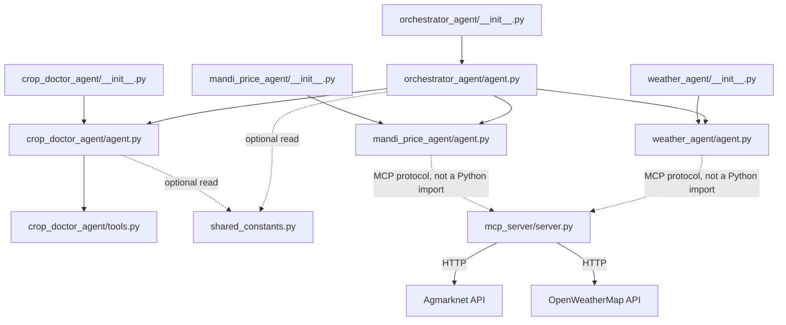

# BLUEPRINT.md — File Responsibility Blueprint (Kisan Sahayak)

Based on the approved `ARCHITECTURE.md` (Revision 2). No architectural
change is made here — this document only assigns responsibilities to
specific files within that already-approved structure.

---

## `orchestrator_agent/__init__.py`

1. **Purpose:** Package marker so ADK's loader (`adk web` / `adk run`)
   can discover the Orchestrator agent.
2. **Responsibilities:** Re-export the `agent` module. Nothing else.
3. **Public classes/functions:** None.
4. **Dependencies (imports):** `orchestrator_agent.agent`
5. **Allowed callers:** ADK runtime only.
6. **Must NOT depend on:** Any specialist package, `mcp_server`,
   `shared_constants`.
7. **Never implement here:** Routing logic, instruction text, tool code —
   all belong in `agent.py`.

---

## `orchestrator_agent/agent.py`

1. **Purpose:** Defines the single Orchestrator — the only entry point
   that classifies farmer intent and transfers control.
2. **Responsibilities:** Hold the routing instruction (few-shot examples,
   image-priority rule, multi-intent handling, one-clarification cap,
   the "never call tools directly" rule); declare `sub_agents=[...]`.
3. **Public classes/functions:** `root_agent` (the only public symbol).
4. **Dependencies (imports):** `google.adk.agents.Agent`;
   `crop_doctor_agent.agent.root_agent`;
   `mandi_price_agent.agent.root_agent`;
   `weather_agent.agent.root_agent`;
   optionally `shared_constants.CROPS` (for routing examples only).
5. **Allowed callers:** `orchestrator_agent/__init__.py` only.
6. **Must NOT depend on:** `mcp_server/server.py`,
   `crop_doctor_agent/tools.py` (must delegate to the sub-agent, never
   call a specialist's tool directly).
7. **Never implement here:** Disease diagnosis, price lookup, or weather
   logic; any tool-calling code; any farmer-facing domain content beyond
   routing/clarification text.

---

## `crop_doctor_agent/__init__.py`

1. **Purpose:** Package marker for ADK discovery.
2. **Responsibilities:** Re-export `agent` module.
3. **Public classes/functions:** None.
4. **Dependencies (imports):** `crop_doctor_agent.agent`
5. **Allowed callers:** `orchestrator_agent/agent.py` (imports
   `root_agent` from here), ADK runtime.
6. **Must NOT depend on:** Any other agent package, `mcp_server`.
7. **Never implement here:** Instruction text, tool code.

---

## `crop_doctor_agent/agent.py`

1. **Purpose:** Defines the Crop Doctor specialist — vision-based
   diagnosis for tomato/wheat.
2. **Responsibilities:** Hold the diagnosis instruction, **build the
   valid `disease_key` list into that instruction by reading it from
   `tools.DISEASE_DB.keys()` at import time** (not by hardcoding a
   second copy) — this is how the §4 key-mismatch bug fix stays a
   single source of truth; attach `tools=[lookup_disease_info]`.
3. **Public classes/functions:** `root_agent`.
4. **Dependencies (imports):** `google.adk.agents.Agent`;
   `crop_doctor_agent.tools.lookup_disease_info`;
   `crop_doctor_agent.tools.DISEASE_DB` (read-only, to derive the key
   list); optionally `shared_constants.CROPS`.
5. **Allowed callers:** `crop_doctor_agent/__init__.py`;
   `orchestrator_agent/agent.py`.
6. **Must NOT depend on:** `mandi_price_agent/*`, `weather_agent/*`,
   `mcp_server/*`, `orchestrator_agent/*` (importing the Orchestrator
   back would create a cycle).
7. **Never implement here:** Any network/MCP call; price or weather
   logic; routing decisions for other intents.

---

## `crop_doctor_agent/tools.py`

1. **Purpose:** The single verified source of truth for tomato/wheat
   disease data, exposed as a grounding tool.
2. **Responsibilities:** Define `DISEASE_DB`; define
   `lookup_disease_info(crop, disease_key) -> dict`. Nothing about
   phrasing, Hindi translation, or severity judgment.
3. **Public classes/functions:** `lookup_disease_info`, `DISEASE_DB`.
4. **Dependencies (imports):** None — deliberately dependency-free
   (pure Python), making it the most stable, most testable file in the
   project.
5. **Allowed callers:** `crop_doctor_agent/agent.py` only.
6. **Must NOT depend on:** `google.adk` (ADK auto-wraps plain functions
   as tools — no SDK import needed here), any `agent.py`, `mcp_server`.
7. **Never implement here:** Hindi phrasing, severity assessment (that's
   visual reasoning done by the LLM, not static data), any network call.

---

## `mandi_price_agent/__init__.py`

Same pattern as `crop_doctor_agent/__init__.py`, scoped to this package.
Allowed caller: `orchestrator_agent/agent.py`. Never implement instruction
or tool-connection code here.

---

## `mandi_price_agent/agent.py`

1. **Purpose:** Defines the Mandi Price specialist.
2. **Responsibilities:** Hold the Hindi price-reporting instruction and
   its one static fallback price-range line (used only if the MCP call
   fails); connect to the shared MCP server's `get_mandi_price` tool.
3. **Public classes/functions:** `root_agent`.
4. **Dependencies (imports):** `google.adk.agents.Agent`; an MCP client
   tool wrapper pointed at the shared server (a **runtime protocol
   connection**, not a Python import of `mcp_server/server.py`).
5. **Allowed callers:** `mandi_price_agent/__init__.py`;
   `orchestrator_agent/agent.py`.
6. **Must NOT depend on:** `crop_doctor_agent/*`, `weather_agent/*`,
   `orchestrator_agent/*`, and must **not** `import mcp_server.server`
   directly as Python code — only talk to it over MCP.
7. **Never implement here:** Disease logic, weather logic, or the actual
   Agmarknet HTTP-calling code (that lives only in `mcp_server/server.py`).

---

## `weather_agent/__init__.py`

Mirror of the pattern above, scoped to this package.

---

## `weather_agent/agent.py`

1. **Purpose:** Defines the Weather Advisor specialist.
2. **Responsibilities:** Hold the Hindi spray/irrigation-advice
   instruction and its one static fallback rule-of-thumb line; connect
   to the shared MCP server's `get_weather_forecast` tool.
3. **Public classes/functions:** `root_agent`.
4. **Dependencies (imports):** `google.adk.agents.Agent`; an MCP client
   tool wrapper (runtime protocol connection, not a Python import).
5. **Allowed callers:** `weather_agent/__init__.py`;
   `orchestrator_agent/agent.py`.
6. **Must NOT depend on:** `crop_doctor_agent/*`, `mandi_price_agent/*`,
   `orchestrator_agent/*`, and must not import `mcp_server/server.py`
   directly.
7. **Never implement here:** Disease or price logic; the actual
   OpenWeatherMap HTTP-calling code (lives only in `mcp_server/server.py`).

---

## `mcp_server/server.py`

1. **Purpose:** The single shared MCP server process exposing
   `get_mandi_price` and `get_weather_forecast` to any connecting agent.
2. **Responsibilities:** Own all external HTTP-calling code for
   Agmarknet and OpenWeatherMap; return structured data only.
3. **Public classes/functions:** The two MCP tool definitions
   (`get_mandi_price`, `get_weather_forecast`) — reachable only via the
   MCP protocol, never via direct Python import.
4. **Dependencies (imports):** An HTTP client library; the MCP server
   SDK; `.env` for API keys.
5. **Allowed callers:** `mandi_price_agent/agent.py` and
   `weather_agent/agent.py` — via MCP protocol only.
6. **Must NOT depend on:** Any `agent.py` file, `crop_doctor_agent/tools.py`,
   `orchestrator_agent/*` — this file has zero knowledge that agents
   exist.
7. **Never implement here:** Hindi phrasing, farmer-facing text,
   diagnosis/severity logic, any LLM/prompt call — raw structured data
   only; the calling specialist decides how to phrase it.

---

## `shared_constants.py` (optional)

1. **Purpose:** Single source of truth for the one value genuinely
   reused across packages: `CROPS = ["tomato", "wheat"]`.
2. **Responsibilities:** Constant definitions only. **Note:** disease
   keys are *not* duplicated here — they are derived from
   `crop_doctor_agent/tools.py` at the point of use (see that file's
   entry) to avoid a second source of truth.
3. **Public classes/functions:** `CROPS`.
4. **Dependencies (imports):** None — must stay a leaf node.
5. **Allowed callers:** `orchestrator_agent/agent.py`,
   `crop_doctor_agent/agent.py` (read-only).
6. **Must NOT depend on:** Anything in the project.
7. **Never implement here:** Any function or logic — the moment this
   file gains a function, it has stopped being "constants" and has
   become hidden business logic.

---

## Non-code files (brief)

| File | Purpose | Never implement here |
|---|---|---|
| `.env.example` | Documents required env vars (API keys) | Real secrets — never commit actual keys |
| `SPEC.md` | Product spec | Any architecture/implementation detail |
| `ARCHITECTURE.md` | Approved architecture | Code |
| `BLUEPRINT.md` | This file | Code |
| `README.md` | Setup/run instructions | Design decisions (link to ARCHITECTURE.md instead) |
| `demo_script.md` | Rehearsed demo queries + sample images | Any logic |
| `sample_images/` | Static PlantVillage sample photos | Any code |

---

## Verification

**Every responsibility belongs to exactly one file:**

| Responsibility | Owning file (only) |
|---|---|
| Intent classification / routing | `orchestrator_agent/agent.py` |
| Disease visual diagnosis (LLM reasoning) | `crop_doctor_agent/agent.py` |
| Verified disease treatment/prevention data | `crop_doctor_agent/tools.py` |
| Mandi price HTTP fetching | `mcp_server/server.py` |
| Weather HTTP fetching | `mcp_server/server.py` |
| Price response phrasing (Hindi) + its fallback line | `mandi_price_agent/agent.py` |
| Weather response phrasing (Hindi) + its fallback line | `weather_agent/agent.py` |
| Valid disease-key vocabulary | `crop_doctor_agent/tools.py` (agent.py *reads* it, doesn't redefine it) |

**No business logic duplicated:** the one real duplication risk flagged
during the architecture review — the disease-key list appearing in both
the knowledge base and the Crop Doctor's instruction — is resolved by
having `crop_doctor_agent/agent.py` derive the list from
`tools.DISEASE_DB.keys()` at import time instead of hardcoding a second
copy. `shared_constants.py` intentionally holds only `CROPS`, not
`DISEASE_KEYS`, to avoid creating a third copy.

**No circular dependencies:** `orchestrator_agent/agent.py` is the only
file that imports the specialist agents; no specialist imports the
Orchestrator or another specialist. `mcp_server/server.py` has zero
project-internal imports — it is a standalone process reachable only via
the MCP protocol, which is a runtime connection, not a Python import, so
it cannot participate in an import cycle. `crop_doctor_agent/tools.py`
and `shared_constants.py` are leaf nodes with no project-internal
imports.

**Structure is optimal for ADK:** matches ADK's standard conventions —
one `root_agent` per package, the Orchestrator using `sub_agents` for
LLM-driven transfer, specialist tools as plain Python functions
(auto-wrapped as `FunctionTool` by ADK) or an MCP toolset, and a single
shared MCP process serving two stateless tools.

---

## Dependency Diagram

No arrow points back into `orchestrator_agent/agent.py` — confirming the
graph is acyclic.