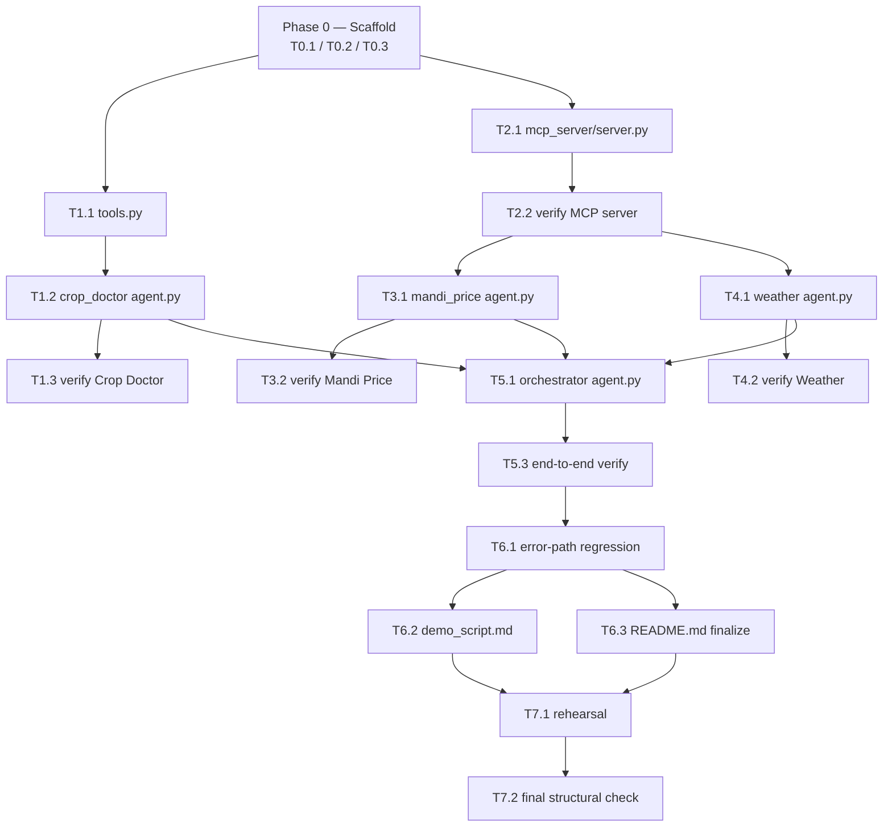

# IMPLEMENTATION_ROADMAP.md — Kisan Sahayak (Farmer's AI Assistant)

*Sequencing document only. Does not modify, redesign, or reinterpret
`SPEC.md`, `ARCHITECTURE.md`, `BLUEPRINT.md`, `AGENT_SPECIFICATIONS.md`,
or `API_CONTRACTS.md` — all five are frozen and authoritative. This file
adds nothing new: no files, no prompts, no schemas, no agents beyond what
those five documents already define. Its only job is to break the
already-approved design into small, ordered, independently-executable
build tasks.*

Optimized for: **Google ADK** (`adk web` / `adk run` per-package
discovery), **Antigravity-style agentic execution** (one task = one
dispatchable agent run, each producing its own reviewable artifact),
**minimum token usage** (tasks cite doc §sections instead of repeating
their content), and a **solo 5-day hackathon window** ending July 6,
2026.

---

## 0. How to Use This Roadmap

1. **One task = one dispatch.** Whether you're running these yourself or
   handing them to an agentic IDE, execute exactly one task ID at a
   time. Don't bundle two task IDs into one prompt, even if they touch
   adjacent files.
2. **Read only the cited sections, not the whole document.** Every task
   below lists `Reads:` with exact doc + § references. Open only those
   sections into context. This is the main token-saving lever in this
   plan — the source docs are long; a given task usually needs one
   system prompt or one schema, not the whole file.
3. **Copy, don't paraphrase.** Where a task says "copy verbatim," the
   system prompt / schema / constant already exists word-for-word in a
   frozen doc. Reproduce it exactly. Do not shorten, reword, or
   "improve" it — that would silently change approved behavior.
4. **If a task seems to need a file outside its listed scope, stop.**
   That's a signal the task boundary is wrong, not a signal to expand
   scope. Re-check that file's "Must NOT depend on" / "Never implement
   here" rows in `BLUEPRINT.md` before touching anything extra.
5. **Verification steps are part of the task, not optional polish.**
   Each task's `Verify:` line is its Definition of Done in action —
   run it before marking the task complete.

---

## 1. Source-of-Truth Map

| Question | Answer lives in |
|---|---|
| What are we building, for whom, within what constraints | `SPEC.md` |
| System diagrams, routing rules, request lifecycle, error-handling table | `ARCHITECTURE.md` |
| Which file owns which responsibility, allowed callers/dependencies | `BLUEPRINT.md` |
| Exact system prompts, decision rules, example conversations | `AGENT_SPECIFICATIONS.md` |
| Exact JSON schemas, error codes, retry/timeout numbers | `API_CONTRACTS.md` |
| Task order, file scope per task, build schedule | **this file** |

If two docs ever appear to disagree, the more specific/later one wins in
this order: `API_CONTRACTS.md` > `AGENT_SPECIFICATIONS.md` >
`BLUEPRINT.md` > `ARCHITECTURE.md` > `SPEC.md`. This roadmap never
overrides any of them — if a conflict shows up, stop and flag it rather
than picking a side.

---

## 2. Build Order at a Glance

Two independent tracks share only Phase 0 as a prerequisite and only
rejoin at T5.1:

- **Track A (Crop Doctor)** — fully offline, no external API, no MCP.
- **Track B (Mandi Price + Weather)** — depends on the shared MCP
  server, nothing else.

---

## 3. Task Template

Every task below uses this shape:

| Field | Meaning |
|---|---|
| **Files** | The only file(s) this task creates/edits (1–3, per hackathon scoping) |
| **Depends on** | Task IDs that must be done first |
| **Reads** | Exact doc §sections to open — nothing else needed |
| **Build** | One-line description of what goes in the file (not the content itself — that's in `Reads`) |
| **Definition of Done** | Checklist to confirm before moving on |
| **Verify** | The concrete manual/CLI check that proves it |

---

## 4. Phase 0 — Project Scaffold & Environment

*One-time exception to the 1–3-files rule: the four `__init__.py`
stubs are identical, zero-logic, one-line re-exports (per each
package's `BLUEPRINT.md` entry: "Re-export the `agent` module. Nothing
else."). Creating all four together is mechanical, not a design
decision, so it's batched into a single task instead of four.*

#### T0.1 — Folder skeleton + package markers
| | |
|---|---|
| **Files** | `orchestrator_agent/__init__.py`, `crop_doctor_agent/__init__.py`, `mandi_price_agent/__init__.py`, `weather_agent/__init__.py` (4, all trivial) |
| **Depends on** | — |
| **Reads** | `ARCHITECTURE.md` §7 (folder tree) · `BLUEPRINT.md` (each package's `__init__.py` entry) |
| **Build** | Create the full `kisan_sahayak/` directory tree from `ARCHITECTURE.md` §7 (including empty `mcp_server/`, `sample_images/` dirs); each `__init__.py` re-exports its package's `agent` module only |
| **Definition of Done** | Directory tree matches §7 exactly; each `__init__.py` contains only a re-export line, no logic |
| **Verify** | `find kisan_sahayak -type d` matches the §7 tree; `python -c "import ast; ..."` or a quick read confirms each `__init__.py` has no logic |

#### T0.2 — Environment & dependency manifest
| | |
|---|---|
| **Files** | `.env.example`, dependency manifest (`requirements.txt` or `pyproject.toml`) |
| **Depends on** | T0.1 |
| **Reads** | `SPEC.md` "Tech Stack" and "APIs" sections · `BLUEPRINT.md` `.env.example` entry |
| **Build** | `.env.example` documents required keys only (Gemini API key, Agmarknet/data.gov.in key, OpenWeatherMap key) — no real secrets, per `BLUEPRINT.md`'s explicit "never commit actual keys" rule; manifest lists Google ADK's Python package, an MCP SDK, an HTTP client, and `python-dotenv` |
| **Definition of Done** | `.env.example` has placeholder values only; manifest installs cleanly in a fresh venv |
| **Verify** | `pip install -r requirements.txt` (or equivalent) succeeds in a clean virtual environment |

#### T0.3 — README skeleton
| | |
|---|---|
| **Files** | `README.md` |
| **Depends on** | T0.1 |
| **Reads** | `BLUEPRINT.md` non-code files table (README row: "Setup/run instructions... never design decisions") |
| **Build** | Headers only for now: Setup, Environment Variables, Running Locally, Demo — content filled in at T6.3 once the system actually runs |
| **Definition of Done** | Skeleton exists with correct section headers, no placeholder design content |
| **Verify** | Visual read-through; confirm no architectural claims sneak in (those belong only in `ARCHITECTURE.md`) |

---

## 5. Phase 1 — Track A: Crop Doctor (offline vertical)

*Fully self-contained — no network, no MCP, no dependency on Phase 2.
Can be built in parallel with Phase 2.*

#### T1.1 — Disease knowledge base + lookup tool
| | |
|---|---|
| **Files** | `crop_doctor_agent/tools.py` |
| **Depends on** | T0.1 |
| **Reads** | `API_CONTRACTS.md` §0.5 (KB schema), §1 (`lookup_disease_info` full contract: input/output schemas, validation rules, edge cases) · `AGENT_SPECIFICATIONS.md` §2 (the 6 valid `disease_key` values) |
| **Build** | `DISEASE_DB` dict with exactly 6 entries (tomato: `early_blight`, `late_blight`, `leaf_curl_virus`; wheat: `yellow_rust`, `brown_rust`, `powdery_mildew`), each matching the §0.5 shape; `lookup_disease_info(crop, disease_key)` implementing §1's normalization, validation, and exact success/not-found/error envelopes |
| **Definition of Done** | All 6 entries have real (non-placeholder) symptoms/treatment/prevention text; function returns the exact `found: true`, `found: false`, and `E_UNSUPPORTED_CROP`/`E_INVALID_INPUT` shapes from §1; zero imports beyond the standard library, per `BLUEPRINT.md`'s "deliberately dependency-free" rule |
| **Verify** | Direct calls (REPL or throwaway script — not committed) against §1's three edge cases: mixed-case input (`"Tomato "`), a valid key for the wrong crop, and `null`/numeric input |

#### T1.2 — Crop Doctor agent
| | |
|---|---|
| **Files** | `crop_doctor_agent/agent.py` |
| **Depends on** | T1.1 |
| **Reads** | `AGENT_SPECIFICATIONS.md` §2 full system prompt · `BLUEPRINT.md` `crop_doctor_agent/agent.py` entry (derive-not-hardcode rule) |
| **Build** | `root_agent` (ADK `Agent`/`LlmAgent`) with §2's system prompt copied verbatim, `tools=[lookup_disease_info]`; the valid-`disease_key` list is built into the instruction **by reading `tools.DISEASE_DB.keys()` at import time**, not by retyping the list — this is the single-source-of-truth fix from `ARCHITECTURE.md` §4 |
| **Definition of Done** | `root_agent` is the only public symbol; instruction text is byte-for-byte the §2 prompt with the key list interpolated from `tools.py`, not duplicated as a second literal list |
| **Verify** | `adk web` (or `adk run`) scoped to `crop_doctor_agent` alone — this package is independently runnable without any other agent existing yet |

#### T1.3 — Verify Crop Doctor standalone
| | |
|---|---|
| **Files** | none (verification only) |
| **Depends on** | T1.2, T1.4 |
| **Reads** | `AGENT_SPECIFICATIONS.md` §2 "Example Conversations" · `ARCHITECTURE.md` §9 (Crop Doctor rows) |
| **Build** | — |
| **Definition of Done** | All three §2 example conversations reproduce correctly: clear diagnosis, blurry-photo-then-best-effort, unsupported-crop message |
| **Verify** | Run each of the three cases through `adk web`; confirm: `lookup_disease_info` is called before any treatment text appears; dosage is never stated as a specific number; Gambhir severity always adds the "see local expert" line; response uses the exact emoji-labeled Hindi format from §2 |

#### T1.4 — Sample images
| | |
|---|---|
| **Files** | `sample_images/` (static assets, no code) |
| **Depends on** | — (parallel with T1.1–T1.3) |
| **Reads** | `ARCHITECTURE.md` §7 (folder purpose), §11 (PlantVillage source) |
| **Build** | A handful of PlantVillage leaf photos covering: one per tomato disease key, one per wheat disease key, one off-scope crop (e.g. mango) for the unsupported-crop test, one deliberately blurry shot for the retake-flow test |
| **Definition of Done** | At least 6 disease images (one per key) + 1 off-scope + 1 blurry, filenames indicate expected crop/disease |
| **Verify** | Visual spot-check against the 6 `disease_key` values |

---

## 6. Phase 2 — Track B Foundation: Shared MCP Server

*Both external-data specialists depend on this; nothing in Phase 2
depends on Phase 1.*

#### T2.1 — MCP server (both tools)
| | |
|---|---|
| **Files** | `mcp_server/server.py` |
| **Depends on** | T0.1, T0.2 |
| **Reads** | `API_CONTRACTS.md` §3 (`get_weather_forecast`), §4 (`get_mandi_price`), §6 (MCP transport envelope), §0.2 (error codes), §0.7 (retry/timeout table) |
| **Build** | Both MCP tools in one process/file: `get_mandi_price` → Agmarknet/data.gov.in, `get_weather_forecast` → OpenWeatherMap; each follows its §3/§4 input schema, success/fallback/failure envelopes, 1-retry-after-2s policy, 5s/attempt (10s total) timeout; reads API keys from `.env` |
| **Definition of Done** | Both tools registered and reachable only via MCP protocol (no other project file imports this one directly, per `BLUEPRINT.md`); malformed arguments rejected before any external HTTP call (§6 fail-fast rule); zero project-internal imports (leaf/standalone process) |
| **Verify** | Start the server standalone; confirm it has no import of any `agent.py` |

#### T2.2 — Verify MCP server
| | |
|---|---|
| **Files** | none (verification only) |
| **Depends on** | T2.1 |
| **Reads** | `API_CONTRACTS.md` §3, §4, §6 (mock success/failure payloads to compare against) |
| **Build** | — |
| **Definition of Done** | Both tools return the exact success-envelope shape on a real call; both simulate the exact failure-envelope shape when the upstream API is unreachable (e.g. wrong key or offline) |
| **Verify** | Call each tool with a throwaway MCP client / test script (not committed): once for a real success, once forcing a failure (bad key or no network) — compare output shape against §3/§4/§6 mocks |

---

## 7. Phase 3 — Track B: Mandi Price Agent

#### T3.1 — Mandi Price agent
| | |
|---|---|
| **Files** | `mandi_price_agent/agent.py` |
| **Depends on** | T2.1 (server must exist to point at; the file itself can be scaffolded in parallel once §4's tool signature is treated as a stable contract) |
| **Reads** | `AGENT_SPECIFICATIONS.md` §3 full system prompt · `BLUEPRINT.md` `mandi_price_agent/agent.py` entry (runtime MCP connection, not a Python import) |
| **Build** | `root_agent` with §3's system prompt copied verbatim; connects to the shared MCP server's `get_mandi_price` tool via ADK's MCP client integration (check current ADK docs for the exact connector API) pointed at the server from T2.1 — never a direct `import mcp_server.server` |
| **Definition of Done** | `root_agent` is the only public symbol; no Python import of `mcp_server.server` anywhere in the file |
| **Verify** | `adk web` scoped to `mandi_price_agent` alone, with T2.1's server running |

#### T3.2 — Verify Mandi Price standalone
| | |
|---|---|
| **Files** | none (verification only) |
| **Depends on** | T3.1, T2.1 |
| **Reads** | `AGENT_SPECIFICATIONS.md` §3 "Example Conversations" · `ARCHITECTURE.md` §9 (Mandi Price MCP-failure row) |
| **Build** | — |
| **Definition of Done** | Live-success path reports a price clearly labeled as live; a forced tool failure (stop the MCP server) triggers the exact fallback line, clearly labeled a general estimate — never presented as live data |
| **Verify** | Run both paths through `adk web`; also test the missing-crop case triggers exactly one combined clarifying question, never two separate ones |

---

## 8. Phase 4 — Track B: Weather Advisor Agent

*Mirrors Phase 3 exactly — can be built in parallel with it (both only
need T2.1).*

#### T4.1 — Weather Advisor agent
| | |
|---|---|
| **Files** | `weather_agent/agent.py` |
| **Depends on** | T2.1 |
| **Reads** | `AGENT_SPECIFICATIONS.md` §4 full system prompt · `BLUEPRINT.md` `weather_agent/agent.py` entry |
| **Build** | `root_agent` with §4's system prompt copied verbatim; connects to `get_weather_forecast` on the shared MCP server via runtime protocol connection only |
| **Definition of Done** | `root_agent` is the only public symbol; no direct import of `mcp_server.server` |
| **Verify** | `adk web` scoped to `weather_agent` alone, with T2.1's server running |

#### T4.2 — Verify Weather Advisor standalone
| | |
|---|---|
| **Files** | none (verification only) |
| **Depends on** | T4.1, T2.1 |
| **Reads** | `AGENT_SPECIFICATIONS.md` §4 "Example Conversations" · `ARCHITECTURE.md` §9 (Weather MCP-failure row) |
| **Build** | — |
| **Definition of Done** | Each of the four interpretation branches (rain/soon-rain, high wind, clear/calm, hot/dry) produces the correct one-line recommendation with a reason; forced tool failure triggers the seasonal fallback line, clearly labeled as a general rule; no raw numeric forecast ever appears in the reply |
| **Verify** | Run all four weather branches (mock or real, depending on current conditions) plus the failure case through `adk web` |

---

## 9. Phase 5 — Integration: Orchestrator

*Join point — everything upstream in both tracks must exist first.*

#### T5.1 — Orchestrator agent
| | |
|---|---|
| **Files** | `orchestrator_agent/agent.py` |
| **Depends on** | T1.2, T3.1, T4.1 |
| **Reads** | `AGENT_SPECIFICATIONS.md` §1 full system prompt · `BLUEPRINT.md` `orchestrator_agent/agent.py` entry |
| **Build** | `root_agent` with §1's system prompt copied verbatim; `sub_agents=[crop_doctor_agent.root_agent, mandi_price_agent.root_agent, weather_agent.root_agent]`; no tools of its own; optionally reads `shared_constants.CROPS` (T5.2) for routing examples only, read-only |
| **Definition of Done** | `root_agent` is the only public symbol; file contains zero tool-calling code and zero domain content beyond routing/clarification text, per `BLUEPRINT.md`'s "never implement here" rule for this file |
| **Verify** | `adk web` at the project root with the Orchestrator as `root_agent` |

#### T5.2 — Shared constants *(optional — skip under time pressure)*
| | |
|---|---|
| **Files** | `shared_constants.py` |
| **Depends on** | T0.1 |
| **Reads** | `BLUEPRINT.md` `shared_constants.py` entry |
| **Build** | `CROPS = ["tomato", "wheat"]` — nothing else. **Do not** add a `DISEASE_KEYS` constant here; that would recreate the duplication bug §4 of `ARCHITECTURE.md` already fixed by having `crop_doctor_agent/agent.py` derive keys from `tools.DISEASE_DB` |
| **Definition of Done** | File contains exactly one constant, no functions, no logic |
| **Verify** | Grep confirms no `def`/`class` in the file |

#### T5.3 — End-to-end verification
| | |
|---|---|
| **Files** | none (verification only) |
| **Depends on** | T5.1 |
| **Reads** | `AGENT_SPECIFICATIONS.md` §1 "Example Conversations" · `ARCHITECTURE.md` §2 (multi-intent handling) |
| **Build** | — |
| **Definition of Done** | Image-based query routes to Crop Doctor regardless of accompanying text; clear text query routes correctly to each of the other two; an ambiguous query gets exactly one clarifying question then routes; a multi-intent message (e.g. disease + price in one turn) answers the primary intent only and appends exactly one follow-up invite line — never fans out to two specialists |
| **Verify** | Run every example conversation from §1 plus one multi-intent message through the fully-wired system via `adk web` |

---

## 10. Phase 6 — Error-Path Hardening & Demo Assets

#### T6.1 — Error-path regression pass
| | |
|---|---|
| **Files** | none (checklist only) |
| **Depends on** | T5.3 |
| **Reads** | `ARCHITECTURE.md` §9 (full error-handling table) |
| **Build** | — |
| **Definition of Done** | Every row of §9 is individually reproduced and confirmed through the fully-wired system: blurry photo → one retake ask → best-effort; unsupported crop; disease not in KB; low-confidence disclaimer; Mandi Price MCP failure → fallback; Weather MCP failure → fallback; simulated Gemini 429 → "system busy" message; ambiguous intent → one question; multi-intent → primary + invite line |
| **Verify** | Walk the table row by row against the live system, checking each off as confirmed |

#### T6.2 — Demo script
| | |
|---|---|
| **Files** | `demo_script.md` |
| **Depends on** | T6.1, T1.4 |
| **Reads** | `ARCHITECTURE.md` §11 (Demo Readiness) |
| **Build** | 3–4 fixed queries with their matching sample images (from T1.4), chosen to reliably hit all three specialists within ~3 minutes |
| **Definition of Done** | Each scripted query has a known-good expected response; sequence covers Crop Doctor, Mandi Price, and Weather at least once each |
| **Verify** | Run the script once end-to-end exactly as written |

#### T6.3 — README finalize
| | |
|---|---|
| **Files** | `README.md` |
| **Depends on** | T5.1 |
| **Reads** | `BLUEPRINT.md` non-code files table (README row) |
| **Build** | Fill in the T0.3 skeleton with real setup/run instructions (env vars, install, `adk web` invocation, MCP server startup) |
| **Definition of Done** | Contains no design-decision content — links to `ARCHITECTURE.md` for that, per `BLUEPRINT.md`'s explicit rule |
| **Verify** | A clean-checkout read-through by someone who hasn't seen the project should be enough to run it |

---

## 11. Phase 7 — Submission Readiness

#### T7.1 — Full rehearsal
| | |
|---|---|
| **Files** | none |
| **Depends on** | T6.2, T6.3 |
| **Reads** | `ARCHITECTURE.md` §11 |
| **Build** | — |
| **Definition of Done** | One uninterrupted run through `demo_script.md`, timed, with routing (§1), the disease-key fix (§4), and fallback behavior (§9) all confirmed working together |
| **Verify** | Live or recorded run-through, no manual intervention mid-script |

#### T7.2 — Final structural check
| | |
|---|---|
| **Files** | none |
| **Depends on** | T7.1 |
| **Reads** | `ARCHITECTURE.md` §7, `BLUEPRINT.md` "Verification" and "Dependency Diagram" sections, `SPEC.md` "Database" section |
| **Build** | — |
| **Definition of Done** | Live folder tree matches §7 exactly; exactly 1 Orchestrator + 3 specialists + 1 MCP server exist (no drift); no database, memory store, or auth was added anywhere; no PII is collected or stored anywhere in the pipeline |
| **Verify** | Diff the actual tree against §7; grep the codebase for any accidental persistence layer |

---

## 12. Suggested 5-Day Schedule

*Mapped to the actual submission deadline in `SPEC.md` (July 6, 2026)
against today's date.*

| Day | Date | Focus |
|---|---|---|
| 1 | Thu Jul 2 | T0.1 → T0.2 → T0.3, then start Track A (T1.1 → T1.2) and Track B foundation (T2.1) in parallel; gather T1.4 sample images whenever convenient |
| 2 | Fri Jul 3 | Finish T1.3; finish T2.2; run T3.1 → T3.2 and T4.1 → T4.2 (concurrently if using two agent sessions) |
| 3 | Sat Jul 4 | T5.1, optional T5.2, then T5.3 full end-to-end verification |
| 4 | Sun Jul 5 | T6.1 error-path regression, then T6.2 and T6.3 (can run concurrently) |
| 5 | Mon Jul 6 | T7.1 rehearsal, T7.2 final check, submit with buffer time remaining |

If time runs short, cut in this order: T5.2 (explicitly optional) first,
then reduce T6.2's script to 3 queries instead of 4 — never cut T6.1 or
T7.1, since an unrehearsed demo is called out in `ARCHITECTURE.md` §11
as the single biggest score risk.

---

## 13. Parallelization Guide

For running multiple agent sessions concurrently (e.g. an agent-manager
style IDE dispatching more than one task at once):

| Can run simultaneously | Because |
|---|---|
| T1.1–T1.4 (Track A) **‖** T2.1–T2.2 (Track B foundation) | Zero shared files, zero shared state — Crop Doctor never touches MCP, per `ARCHITECTURE.md` §4 |
| T3.1–T3.2 (Mandi Price) **‖** T4.1–T4.2 (Weather) | Both depend only on T2.1; neither imports the other, per `BLUEPRINT.md` |
| T6.2 (demo script) **‖** T6.3 (README) | Independent files, both only need a stable system from T6.1 |

Everything else is a strict sequence — in particular, **T5.1 must wait**
for all three specialist `agent.py` files to exist, since it imports
their `root_agent`s directly.

---

## 14. Definition-of-Done Master Checklist

Roll-up of the invariants that matter most, for a final pass before
submission:

- [ ] Exactly 1 Orchestrator, 3 specialists, 1 shared MCP server — no
      extra agents or servers were added anywhere
- [ ] Orchestrator never calls a tool directly and never transfers to
      more than one specialist per turn
- [ ] Every agent's clarifying questions are capped at one per turn
- [ ] Crop Doctor always calls `lookup_disease_info` before stating any
      treatment/prevention detail; never states a specific dosage
- [ ] The valid `disease_key` list in Crop Doctor's instruction is
      derived from `tools.DISEASE_DB.keys()`, not hardcoded a second time
- [ ] Mandi Price / Weather agents never present a fabricated number as
      live data when their MCP tool has failed
- [ ] All farmer-facing text is in simple Hindi
- [ ] No database, vector store, memory, or audit log exists anywhere
- [ ] No PII (phone number, location history, etc.) is collected or
      stored anywhere in the pipeline
- [ ] Live folder structure matches `ARCHITECTURE.md` §7 exactly
- [ ] `README.md` contains setup instructions only, no design decisions

---

## 15. Non-Goals (explicit, to prevent scope creep)

Anything not in this list was intentionally left out of the approved
design and should **not** be added during implementation, even if it
seems like an easy win:

- No persistent database or per-farmer history (SPEC.md "Future work")
- No vector DB, planner, critic, or event queue (ARCHITECTURE.md header)
- No authentication or user accounts
- No payment processing
- No audit log of which agent accessed which data
- No second MCP server — both external tools stay on the one shared server
- No parallel fan-out to two specialists in a single turn
- No crops beyond tomato and wheat
- No retry on a Gemini 429 (`E_RATE_LIMITED` is explicitly non-retryable)
- No cloud deployment of the MCP server — local process is sufficient

---

## 16. File Touch Matrix

Quick reference for exactly which task creates or finalizes each file
in the approved `ARCHITECTURE.md` §7 tree:

| File | Created/finalized by |
|---|---|
| `orchestrator_agent/__init__.py` | T0.1 |
| `orchestrator_agent/agent.py` | T5.1 |
| `crop_doctor_agent/__init__.py` | T0.1 |
| `crop_doctor_agent/agent.py` | T1.2 |
| `crop_doctor_agent/tools.py` | T1.1 |
| `mandi_price_agent/__init__.py` | T0.1 |
| `mandi_price_agent/agent.py` | T3.1 |
| `weather_agent/__init__.py` | T0.1 |
| `weather_agent/agent.py` | T4.1 |
| `mcp_server/server.py` | T2.1 |
| `shared_constants.py` | T5.2 *(optional)* |
| `sample_images/` | T1.4 |
| `demo_script.md` | T6.2 |
| `.env.example` | T0.2 |
| dependency manifest | T0.2 |
| `README.md` | T0.3 (skeleton), T6.3 (final) |

Every file in the approved structure is touched by exactly one task
(two for `README.md`, by design — skeleton then fill-in). No task
touches more than 3 files; no file is written by more than one
task's *content* (README's two passes are additive, not conflicting).
